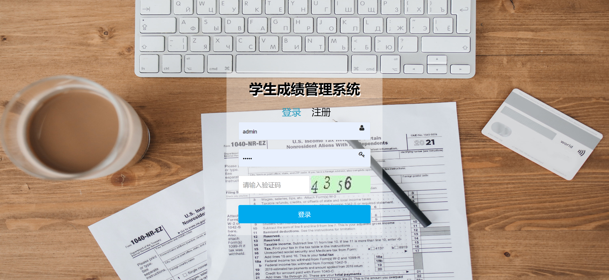
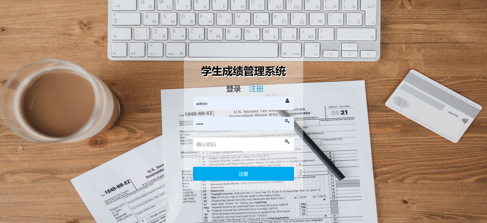
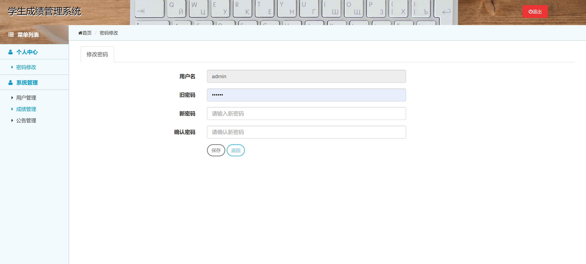
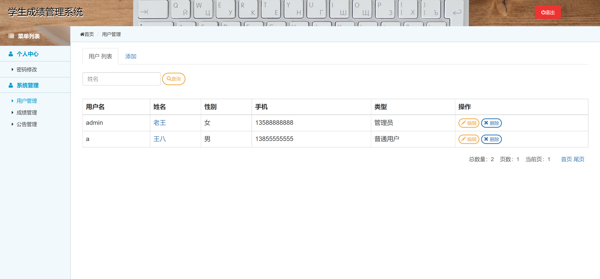
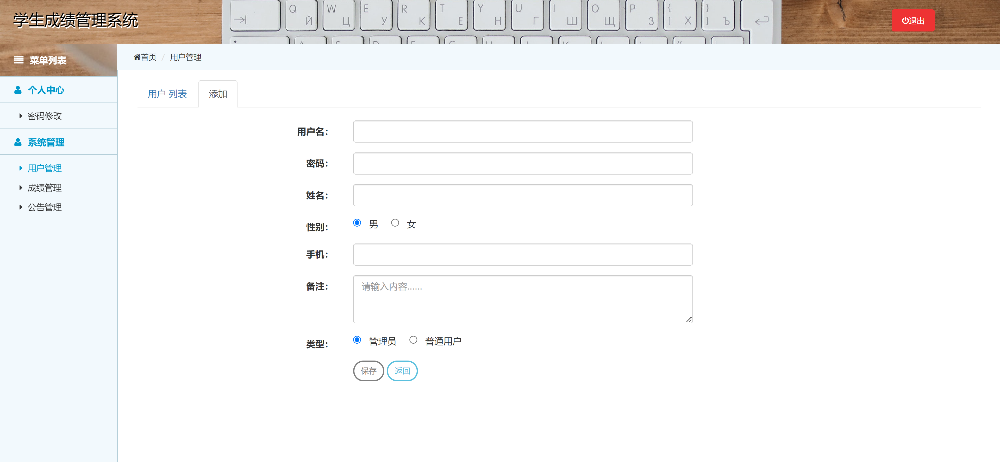
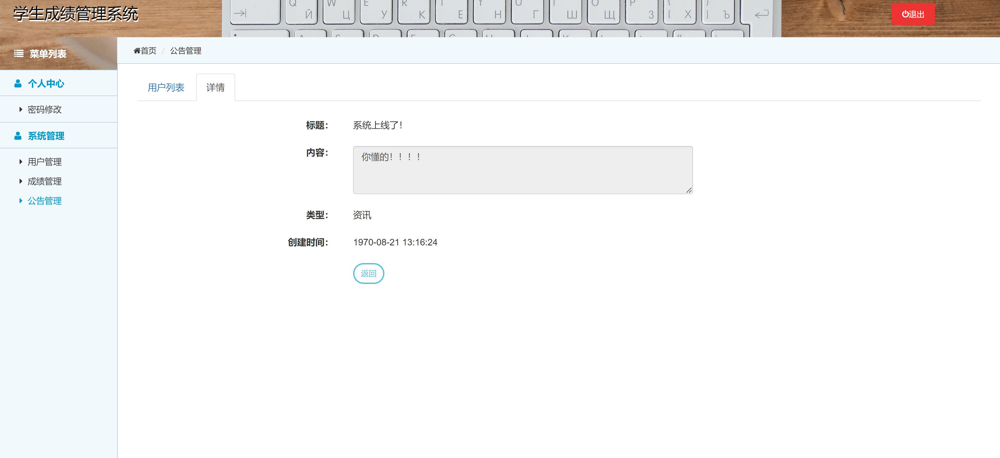

<h1 align="center">学生成绩管理系统3</h1>

## 简介
学生成绩管理系统3：角色分为管理员、普通用户；实现学生信息管理、成绩录入与查询、用户管理、公告管理功能，支持密码修改和成绩报表导出。简洁直观的界面提升用户体验。    --计算机毕业设计源码；毕设源码；java毕业设计源码

## 联系方式

<h3 align="center">获取完整代码与数据库文件 + 微信：bysj5151 QQ: 86050149 QQ群: 783742310</h3>

<h3 align="center">可帮忙远程部署 包运行成功！提供远程部署、修改代码、设计文档指导、代码讲解等服务！</h3>

## 功能介绍（完整见运行截图）
管理员：基本功能包括登录、注册和退出。可以访问个人中心进行密码修改、查看和编辑用户信息以及系统公告。支持用户管理模块，其中包含添加、修改和删除用户信息的功能。系统管理下可进行成绩管理和公告管理，协助教师进行成绩录入与统计分析。

用户：通过登录和注册获得系统访问权限。个人中心容许用户查看和修改个人信息。能够参与成绩的查看与基本管理，使用系统提供的查询和分析功能。用户管理功能包含在管理员权限下，主要用于管理学生信息和相关操作。

## 运行截图

本代码来源于网络,仅供学习参考使用!

